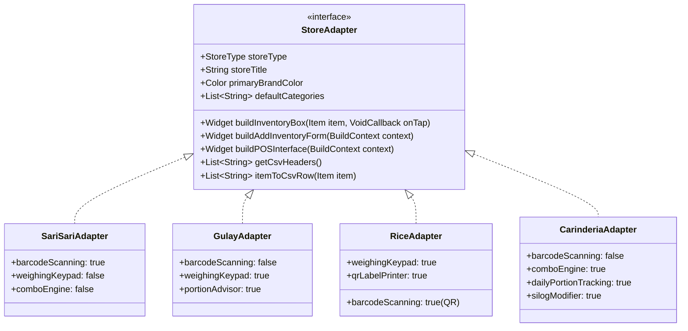
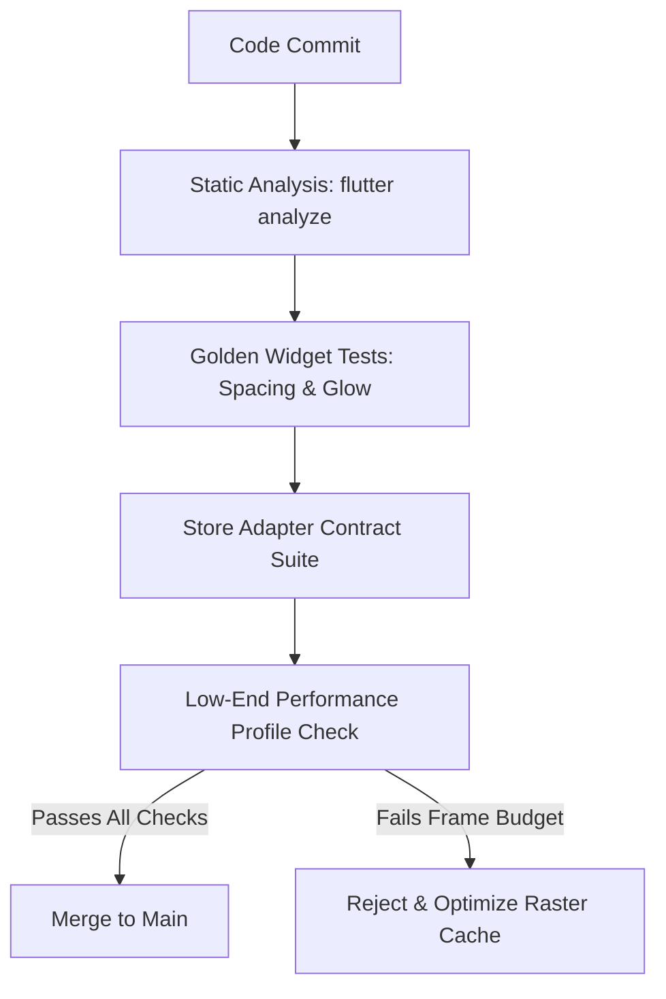

# Sar-E: Master Implementation Plan v3
**Architectural Blueprint & Implementation Guide for a Local-First, Multi-Store POS, Buyer Kiosk, and On-Device Intelligent Management Platform**

*Prepared for:* Harry V. Dimaano, CpE 4102, Batangas State University  
*Project:* Sar-E (Sar-E-Flutter)  
*Version:* 3.0 (Comprehensive Master Release)  
*Date:* October 2026  
*Status:* Approved for Implementation  

---

## Executive Summary

**Sar-E** is an offline-first, privacy-respecting point-of-sale (POS) and inventory platform engineered specifically for grassroots micro-retailers in the Philippines: **Sari-Sari Stores**, **Gulay (Vegetable / Produce) Stalls**, **Bigasan (Rice Bins / Grains)**, and **Carinderias (Eateries / Cooked Food Stalls)**. 

While Sar-E v1 established initial proof-of-concept AI product classification and basic inventory logging, real-world deployment revealed critical hardware and operational hurdles:
1. **GPU Thrashing from Glassmorphism:** The heavy use of `BackdropFilter` and "liquid glass" blurs degrades frame rates to 15–20 fps on entry-level Android smartphones (e.g., 2GB RAM MediaTek Helio A22 / Unisoc devices).
2. **One-Size-Fits-All Inventory Failure:** Fresh vegetables have no barcodes and require dynamic scale-weight pricing and portion estimates; rice requires bin-level printable QR identification and weight math; carinderias sell daily prepared batches, combo bundles (e.g., 1 ulam + 1 kanin), and add-on silogs that cannot be scanned like grocery cans.
3. **Broken Navigation & Inconsistent Layouts:** Store selection during onboarding failed to persist into home navigation, and screen padding across store modes lacked a shared, pixel-perfect baseline.
4. **Psychological Bias in Credit (Utang):** A dedicated, prominent "Listahan" tab inadvertently highlighted debt rather than responsible, unified cash-and-credit tracking.
5. **Lack of Buyer Self-Service:** Customers queuing at busy stalls could not browse menus or stage orders from their own phones without internet.

Sar-E v3 addresses these challenges through a **Zero-Cloud, High-Chroma, Local-First Architecture**. It introduces:
- A **GPU-friendly Design System** utilizing solid high-chroma colors and CSS/Skia-accelerated `BoxShadow` status glows instead of expensive blur filters.
- A **Store Adapter Architecture** that dynamically tailors inventory schemas, forms, POS interfaces, and CSV exports to each store model.
- A **Universal Box-Grid Inventory** featuring real-time search, category chips, and glowing low-stock/out-of-stock alert states.
- A **Buyer Kiosk & Peer Ordering Engine** that lets customers compose carts offline and beam orders to the seller’s POS via high-density dynamic QR codes or local P2P networking without third-party servers.
- A **Unified Kasaysayan Ledger** merging cash sales, customer credit (utang), and repayments into a single chronological financial ledger.
- A **Graphic, Large-Format Analytics Engine** using custom-painted radial rings, busy-hour heatmaps, and plain-language Filipino/English business insights.

---

## Part 1: Comprehensive Voice Transcription & Requirements Matrix

### 1.1 Verbatim Transcription & Thematic Organization
The user's spoken audio instructions have been transcribed, normalized, and categorized into 10 core functional pillars:

```
[UI/UX Overhaul & Performance]
"What I want Sari to improve on is the whole UI itself. Actually, even improve on the UI, even though it is good already... For the whole UI, make it very convincing to be all not using liquid glass now because liquid glass is too much. Maybe just use transparency, yet your main focus now is to also use full full color and glow so that it is easier to be used by different type of mobiles, even though in the low-end one... Make the design of the whole system, the whole UI, the whole application to be clean, easy to use, large icons but not too much spacing on the text, and simple animations. Don't make it vulgar."

[Homepage Navigation & Layout Alignment]
"Additionally have the options of the stores be reflected to when you go on the dashboard or the homepage because when I tried, I didn't get to go to what I chose. And make sure that the padding on the homepage is correct because the gulay, the carenderia one is not, and as well as the rice one is not good. So make the reference is the sari-sari store one. And as well as make the whole UI navigation easy."

[Gulay (Vegetable / Produce) Store Specifics]
"In the first, in the gulay type of store, in here, there should be an option for scale pricing or pricing depending on the scale of the vegetables because not all vegetables are sold by pieces or separate. So maybe have that by kilo and also have an automated kilo of the vegetable generator just to set what is the amount for one kilo and it is capable of understanding how much is for 1.2 or 1.8 like that. And then also what is a good portion for five, for three like that. If it is for cooking, maybe have that AI or have that suggestion, not an option though, just a suggestion when it is picking kilo or adding inputs of kilo... In the vegetable one, you don't need a barcode or QR code for that. So, just have that kilo meter in different assets that is needed for the vegetable market."

[Universal Box-Type Inventory Redesign]
"Change the design of the inventory, make it actually, actually not just in the gulay part, in all of the inventory of the programs or the systems, the stores that is available in the UI, make it become different per store but all the same, not being a list type anymore. Make them all become box type like the gulay ones that is showcasing just important information, not just the, not more of the unnecessary information. Just make it glow or change look if there is a low stock or no stock of it just like that. And then have it being filtered by the system search."

[Store-Adaptive Data Architecture & CSV Backends]
"Make the inventory adapt on the different stores. So the inventory itself, the look and how you add inventory on different stores is different and as well as the inventory storage or the CSV or the the back end. Also, the backend data of each inventory is going to be different, yet being all recorded locally. And then, as well as different fields for different stores is needed."

[Bigasan (Rice) Store Specifics & Printable QR Label Sheets]
"When it comes to the kilo of the rice or the rice option one, where in you could input all of the rice type and then have all of the rice type QR codes be printed with specific label for each barcode or QR code so that it is easy to scan."

[Carinderia (Eatery / Cooked Food) Operations & Kiosk POS]
"In the carenderia, I want you to understand how a carenderia works by having menus that are different in terms of what the carenderia is. It may have meal options like one ulam, one kanin, two ulam, two kanin, or something like that. And then as well as have options that are for meals like silog, like sisig, or something type of meals with add-ons, maybe like that, like a kiosk in in McDo or something like that. And then also make it have a different type of inventory because the carenderia have a different type of inventory. And it also have different type of fields when you're adding meals, so make it adapt to that, not on scanning more on the POS, tapping which is being procured as the order, the meal, the drinks, or something like that."

[Unified Credit (Utang) and Sales History]
"Make the list for utang for all of it or credit. Also, have the history, like make it be shared together so that the credit page is just not there instantly, so that it is not a more preferred thing to have or something like that. Make it be just there to be a list of everything."

[Intuitive, Large-Format Graphic Analytics]
"When you go to the analysis page, the one that is at the last, make it become more intuitive, more graphic, larger graphics. Make it larger larger icons, larger and different, more non-usual graphic."

[Buyer Kiosk Mode, Zero-Cloud Offline Sharing, and Store Credibility]
"Make it also have different UI for buyer and seller so that buyers can also utilize the application by having ability to add to cart whatever they want to buy and then just go to the specific POS to be scanned and they have your order already like a kiosk at your own hand, like that type of thing... Make sure that there is no cloud being used, maybe just the local phone or device sharing the details about what is available in their store for the users. No needed to transmit it into a cloud or database outside the phone, but make sure that the users can be able to see what are the stores being able to go to sell. And then as well as because of that, you need the stores to have location, you need the stores to have certification, but it is not needed to create an account. Make all of the certifications and such be on the credibility of the store on the back end of the store or at the settings to be filled after signing in... Make it so that it could be attached to your Google account when you create an account, but all of the data is localized."
```

### 1.2 Traceability & Feature Matrix

| ID | Spoken Requirement | Technical Implementation | Target Architecture Layer |
|---|---|---|---|
| **REQ-01** | Replace liquid glass with solid color + glow | Deprecate `BackdropFilter` in `LiquidBackground`. Implement `AppGlowTheme` with 0-blur-offset layered `BoxShadow` tokens, high-chroma fill surfaces, and 150–200ms ease-out transitions. | Presentation / `theme/` |
| **REQ-02** | Fix store selection routing & persistent dashboard | Save selected `StoreType` enum in `SharedPreferences` + `store_profile` SQLite table. Refactor `_AppEntry` and `MainShell` to read the active profile and mount the store-specific dashboard. | Application / `auth_provider.dart` |
| **REQ-03** | Standardize page padding to Sari-Sari layout | Create `StoreScaffold` with immutable 16dp horizontal padding, 12dp card gaps, and standard header metrics across all 4 store types. Add golden widget tests. | Presentation / `widgets/` |
| **REQ-04** | Box-type inventory across all stores | Replace vertical `ListView` with responsive `StoreItemBoxGrid` (SliverGrid with 2 to 3 columns depending on screen width). Card shows image/icon, item name, price, and stock badge. | Presentation / `screens/inventory/` |
| **REQ-05** | Glow states for low/out-of-stock | Dynamic card borders and shadows: Normal (subtle outline), Low Stock (Amber glow `0xFFFFB300`), Out of Stock (Crimson glow `0xFFE53935` with 50% opacity dimming and "UBOS" tag). | Presentation / `widgets/item_box.dart` |
| **REQ-06** | Real-time search & category filter | Instant in-memory substring filtering on item name, variety, or dish tags with debounced (150ms) search input and horizontal category chips. | Application / `inventory_provider.dart` |
| **REQ-07** | Store-adaptive fields, forms, and CSVs | Implement `StoreAdapter` contract. Gulay omits barcode and adds weight/price-per-kg; Carinderia tracks daily portions and combos; Rice tracks sack/kg; Sari-Sari tracks SKU/barcode. Custom CSV headers per type. | Domain & Data / `adapters/` |
| **REQ-08** | Gulay dynamic scale pricing & kilo calculator | Weight input keypad with presets (0.25kg, 0.5kg, 1kg, 1.2kg, 1.8kg). Exact arithmetic: $\text{Price} = \text{round}(\text{Weight} \times \text{PricePerKg})$. Centavo or peso rounding settings. | Domain / `services/scale_calculator.dart` |
| **REQ-09** | Cooking portion suggestions (non-blocking) | Heuristic/lookup table + local AI suggesting family servings based on weight (e.g. 1.2kg sitaw/talong feeds 4–5 people for Pinakbet). Displayed as non-intrusive bottom chip. | Domain / `services/portion_advisor.dart` |
| **REQ-10** | Rice variety QR label generation & printing | PDF label sheet generator (A4 24-up sticker grid and 58mm/80mm thermal receipt format) embedding rice variant name, grade, price/kg, and scannable QR payload. | Application / `services/label_printer.dart` |
| **REQ-11** | Carinderia combo meals & silog add-ons | Combo state builder (1 Ulam + 1 Kanin, 2 Ulam + 1 Kanin), Silog configurator with add-ons (extra rice, egg, atchara, softdrink). Tap-to-add kiosk POS with order summary bar. | Presentation & Domain / `screens/carinderia/` |
| **REQ-12** | Unified Kasaysayan (History & Utang Ledger) | Combine sales transactions, customer credit lines, and debt repayments into a single chronological ledger with filter tabs (Lahat, Benta, Utang, Bayad). De-stigmatize credit. | Presentation & Data / `screens/ledger/` |
| **REQ-13** | Intuitive, large-graphic visual analytics | Custom-painted radial sales goal rings, peak-hour heat strips, and category bar charts replacing laggy line charts. High-contrast KPI cards with plain-language business advice. | Presentation / `screens/analytics/` |
| **REQ-14** | Buyer Kiosk Mode with offline QR handoff | Buyer view to browse nearby store catalogs, build a cart, and generate a compressed Base64 QR payload. Seller POS camera scans buyer QR in 500ms to immediately stage order. | Presentation & Sync / `screens/buyer/` |
| **REQ-15** | Local-First Zero-Cloud Architecture | Remove remote database requirements. All operational data stored locally in SQLite (`sare.db`). Google Sign-In used solely for identity/PIN recovery; offline fallback supported. | Data / `database.dart` |
| **REQ-16** | Store trust profile & location setup | Post-onboarding settings allowing owners to enter GPS coordinates/address, upload photo proofs of DTI/Barangay permits. Offline badge displays "Self-Declared Verified Documents Attached". | Presentation & Domain / `screens/settings/` |

---

## Part 2: Codebase Architecture & Gap Analysis

A rigorous inspection of the current Flutter repository reveals key structural gaps that must be refactored:

```
c:\Users\Harry\Downloads\Sar-E-Flutter-main\Sar-E-Flutter-main
├── lib/
│   ├── application/       # Riverpod State Notifiers (auth, inventory, listahan, analytics)
│   ├── data/
│   │   └── local/         # sqflite implementation (sare.db, DAOs)
│   ├── domain/
│   │   └── entities/      # Rigid Product, Customer, CreditEntry models
│   ├── screens/
│   │   ├── main_shell.dart         # Hardcoded Sari-Sari bottom tabs
│   │   ├── setup_screen.dart       # Lacks StoreType selection persistence
│   │   ├── inventory_screen.dart   # Hardcoded barcode validation & vertical ListTile
│   │   ├── listahan_screen.dart    # Isolated Utang screen
│   │   └── analytics_screen.dart   # fl_chart LineChart with high raster complexity
│   ├── theme/             # Material 3 dynamic color tokens
│   └── widgets/
│       └── liquid_background.dart  # Expensive BackdropFilter (ImageFilter.blur)
```

### 2.1 Critical Codebase Bottlenecks Identified

1. **`lib/widgets/liquid_background.dart` (GPU Bottleneck):**
   - *Line 53:* `BackdropFilter(filter: ImageFilter.blur(sigmaX: 8, sigmaY: 8))`
   - *Issue:* Calling `BackdropFilter` inside a full-screen `Stack` on every frame causes continuous offscreen buffer allocations and GPU raster thrashing on budget Mali-G52 / PowerVR GPUs.
   - *Fix:* Replace with flat high-chroma surfaces and localized `BoxDecoration(boxShadow: [BoxShadow(color: accentColor.withOpacity(0.35), blurRadius: 16, spreadRadius: 2)])`.

2. **`lib/screens/setup_screen.dart` (Navigation & State Disconnect):**
   - *Issue:* `_SetupScreenState` allows signing in with Google or offline PIN, but does **not** provide a store type picker (Sari-Sari, Gulay, Rice, Carinderia), nor does it persist a `store_type` field to the database. Consequently, the user is always dumped into the default Sari-Sari scanner.
   - *Fix:* Introduce an interactive Store Profile Onboarding Step (`StoreTypeSelector`), persist `store_type` to `store_profile` table and `SharedPreferences`, and route dynamically to the designated store experience.

3. **`lib/screens/inventory_screen.dart` (Schema Rigidity & Layout Flaws):**
   - *Line 264:* `if (barcodeCtrl.text.trim().isEmpty) { _showMessage('Barcode is required.'); return; }`
   - *Line 672:* `Card(child: ListTile(...))`
   - *Issue:* Fresh vegetables, cooked food, and rice varieties cannot be created because the validator strictly demands a barcode. Furthermore, items are rendered in a dated vertical list with confusing text clusters rather than an uncluttered box grid.
   - *Fix:* Delegate form validation and card rendering to polymorphic `StoreAdapter` instances. Replace `ListView` with `StoreItemBoxGrid`.

4. **`lib/screens/main_shell.dart` & `listahan_screen.dart` (UX Stigmatization):**
   - *Issue:* Bottom tab index 1 is strictly dedicated to "Listahan" (Utang). In Philippine micro-commerce, making credit the primary action promotes bad credit habits and hides vital sales transaction logs inside the analytics screen.
   - *Fix:* Merge `ListahanScreen` and `TransactionsScreen` into a unified `KasaysayanScreen` (Ledger), providing a balanced overview of daily cash income and outstanding receivables.

5. **`lib/screens/analytics_screen.dart` (Visual Clutter):**
   - *Line 74:* `LineChart(LineChartData(...))`
   - *Issue:* Dense line graphs with tiny axis text are difficult to read in bright outdoor market stalls and fail to render smoothly when datasets grow large.
   - *Fix:* Implement high-impact custom painters: Radial Ring Goal visualizers, Hourly Foot-Traffic Heat Strips, and Large KPI Indicator Cards.

---

## Part 3: The Sar-E Design System (Low-End Optimized, High-Chroma)

To guarantee 60 fps on low-end hardware while delivering an attractive, modern UI, Sar-E transitions from "liquid glass" to the **High-Chroma Glow System**.

### 3.1 Design Tokens

```
================================================================================
TOKEN                 VALUE                     USAGE / NOTES
================================================================================
Spacing Base          4dp                       Strict 4-point incremental grid
Page Padding          16dp                      Standardized across all store scaffolds
Card Radius           16dp                      Uniform border radius for item boxes
Sheet Radius          24dp                      Top corners of bottom modal sheets
Chip Radius           32dp                      Full pill radius for category chips
Primary (Sari-Sari)   Color(0xFFC9352C)         Energetic Red-Orange
Primary (Gulay)       Color(0xFF2E7D32)         Fresh Produce Green
Primary (Rice)        Color(0xFFF57F17)         Warm Harvest Golden Amber
Primary (Carinderia)  Color(0xFFD84315)         Savory Flame Terracotta
Surface Background    Color(0xFF121417)         Dark OLED / Deep Slate (High contrast)
Surface Card          Color(0xFF1E2228)         Card fill (No backdrop blur!)
Surface Border        Color(0xFF2D333B)         Subtle structural border (1px)
Status Normal Border  Color(0xFF2D333B)         Clean subtle outline
Status Low Stock Glow Color(0xFFFFB300)         Amber BoxShadow glow (spread: 2, blur: 12)
Status Out Stock Glow Color(0xFFE53935)         Crimson BoxShadow glow + 50% opacity fill
================================================================================
```

### 3.2 Performance Rules for Low-End Devices
1. **Zero BackdropFilter Rule:** Under no circumstances should `BackdropFilter`, `ImageFilter.blur()`, or transparent blurred overlays be applied.
2. **Precomputed Shadows:** All glow effects use standard `BoxShadow` with zero offset:
   ```dart
   BoxDecoration(
     color: AppColors.surfaceCard,
     borderRadius: BorderRadius.circular(16),
     border: Border.all(
       color: isLowStock ? const Color(0xFFFFB300) : const Color(0xFF2D333B),
       width: isLowStock ? 1.5 : 1.0,
     ),
     boxShadow: isLowStock
         ? [
             BoxShadow(
               color: const Color(0xFFFFB300).withOpacity(0.35),
               blurRadius: 12,
               spreadRadius: 1,
             ),
           ]
         : null,
   )
   ```
3. **Const Widget Constructors:** Every static layout component and spacer must be instantiated as `const` to avoid GC pauses during rapid scrolling.
4. **Bitmap Image Caching:** All product photos and assets are downscaled and cached using `ResizeImage` to a maximum resolution of $256 \times 256$ pixels before rendering.

---

## Part 4: Store Adapters & Operational Specifications

Sar-E's core engine remains unified, while UI screens dynamically adapt based on the active `StoreAdapter`.



### 4.1 Gulay (Produce / Vegetable Market) Adapter

```
+--------------------------------------------------------------+
| GULAY POS & INVENTORY WORKFLOW                               |
|                                                              |
| [1. Select Produce] ---> [2. Scale Pricing Keypad]            |
| (Talong, Sitaw, Sibuyas)  - Base Price: P80.00 / kg          |
|                           - Quick Weight Chips:              |
|                             [0.25kg] [0.5kg] [1kg] [1.5kg]   |
|                           - Custom Input: "1.8" kg           |
|                                                              |
|                                     |                        |
|                                     v                        |
| [3. Dynamic Portion Advisor] <-------------------------------+
|   "1.8 kg feeds approx 6-8 people for Pinakbet"              |
|   (Non-blocking hint chip)                                   |
|                                     |                        |
|                                     v                        |
| [4. Exact Price Computed: P144.00] -> [Add to Cart]          |
+--------------------------------------------------------------+
```

- **Pricing by Scale:** Vegetables are sold by weight. The item model defines `price_per_kg`.
- **Dynamic Scale Price Generator:** 
  $$\text{Computed Price} = \text{round}(\text{Weight in kg} \times \text{Price per kg})$$
  Example: Sibuyas at ₱140.00/kg:
  - $0.25\text{ kg} = ₱35.00$
  - $1.20\text{ kg} = ₱168.00$
  - $1.80\text{ kg} = ₱252.00$
- **Cooking Portion Advisor:**
  - Built-in heuristic engine mapped to typical Philippine culinary portion yields:
    - *Sitaw / Kalabasa / Talong:* $\sim 0.25\text{ kg}$ per 1 adult serving for Pinakbet/Sinigang.
    - *Patatas / Karot:* $\sim 0.20\text{ kg}$ per serving for Menudo/Afritada.
    - *Sibuyas / Bawang:* Kitchen aromatics (displays recipe batch yield).
  - Appears as a soft, reassuring badge below the weight field: *"Pang 3–5 katao sa Sinigang."*
- **No Barcode Requirement:** Barcode and QR code input fields are completely hidden. Primary selection is visual (produce icon / photo + produce name).

### 4.2 Bigasan (Rice Store) Adapter

```
+--------------------------------------------------------------+
| BIGASAN BIN IDENTIFICATION & LABEL WORKFLOW                  |
|                                                              |
| [Rice Varieties Setup]                                       |
| - Dinorado Special (P56/kg)                                  |
| - Sinandomeng Well-Milled (P48/kg)                           |
| - Jasmine Fragrant (P62/kg)                                  |
|                              |                               |
|                              v                               |
| [Generate Printable QR Label Sheet]                          |
| - Outputs standard A4 PDF / 58mm Thermal Sticker             |
| - Card Contains: Variety Name + Milling Grade + QR Code      |
|                              |                               |
|                              v                               |
| [Affix QR Label directly to Wooden Bin or Sack]              |
|                              |                               |
|                              v                               |
| [POS Workflow]                                               |
| 1. Cashier scans Bin QR Code                                 |
| 2. App prompts: "Ilang Kilo?" (Keypad: 1, 2, 5, 10, Sack)    |
| 3. Auto-computes total & updates inventory                   |
+--------------------------------------------------------------+
```

- **Rice Varieties Catalog:** Tracks variety name, milling type (Well-milled, Regular, Premium), price per kg, price per 25kg/50kg sack, and current stock in kilograms.
- **Batch Printable QR Label Generator:**
  - Integrated PDF generation service using the `pdf` and `printing` Flutter plugins.
  - Generates scannable QR label sheets formatted for standard A4 sticker paper (24 labels per sheet) or direct ESC/POS Bluetooth thermal label printers (50mm $\times$ 30mm stickers).
  - QR payload format: `sare://rice?id=RICE_001&price=52.00&variety=Dinorado`.
- **Fast POS Scanning:** Cashier points camera at the rice bin QR sticker; POS immediately recognizes the grain, pops up the kilo selector with common presets (0.5, 1, 2, 5, 10, 25, 50 kg), and stages the line item.

### 4.3 Carinderia (Cooked Food & Eatery) Adapter

```
+--------------------------------------------------------------+
| CARINDERIA KIOSK & TAP-ORDER POS                             |
|                                                              |
| [COMBO BUILDER]                                              |
| +----------------------------------------------------------+ |
| | 1 Ulam + 1 Kanin (P65.00)                                | |
| | Step 1: Tap Ulam -> [Pork Adobo]                         | |
| | Step 2: Auto-adds Extra Plain Rice                       | |
| +----------------------------------------------------------+ |
| | 2 Ulam + 1 Kanin (P95.00)                                | |
| | Step 1: Tap Ulam 1 -> [Menudo]                           | |
| | Step 2: Tap Ulam 2 -> [Ginisang Sayote]                  | |
| +----------------------------------------------------------+ |
|                                                              |
| [SILOG & CUSTOM MEALS WITH ADD-ONS]                          |
| - Tapsilog (P85.00)                                          |
|   [x] Extra Sunny-Side Egg (+P15.00)                         |
|   [ ] Extra Garlic Rice (+P15.00)                            |
|   [x] Add Gulaman Drink (+P12.00)                            |
|                                                              |
| [DAILY PORTION INVENTORY]                                    |
| - Morning Prep: Adobo (30 servings), Menudo (25 servings)   |
| - Real-time decrement per meal sold                          |
| - Auto-displays "UBOS NA" banner when 0 portions remain      |
+--------------------------------------------------------------+
```

- **Meal Combos Engine:**
  - Cashier selects combo structure:
    - *Combo A:* 1 Ulam + 1 Kanin (Fixed price e.g. ₱65)
    - *Combo B:* 2 Ulam + 1 Kanin (Fixed price e.g. ₱95)
    - *Combo C:* 2 Half-Ulam + 1 Kanin (Budget combo e.g. ₱75)
  - POS workflow requires tapping the designated number of ulam slots from today's prepared dishes.
- **Silog & Sisig Builders with Modifiers:**
  - Meals support customizable modifier groups:
    - *Egg style:* Sunny side up / Scrambled.
    - *Add-ons:* Extra Garlic Rice (+₱15), Extra Fried Egg (+₱15), Atcharang Papaya (+₱10), Sabaw ng Bulalo (Free).
    - *Drinks / Palamig:* Sago't Gulaman (+₱15), Buko Juice (+₱20), Softdrinks (+₱20).
- **Daily Prep Inventory (Batch Cookery):**
  - Instead of standard retail SKUs, the owner logs morning cooked batch yields: e.g., Kaldereta: 25 portions; Sinigang: 30 portions; Kanin: 80 cups.
  - As meals are sold, portions count down live. Out-of-stock items disable dynamically on the POS menu.

### 4.4 Universal Box-Grid Inventory Across All Stores

```
+--------------------------------------------------------------+
| UNIVERSAL INVENTORY SCREEN (BOX-TYPE GRID)                   |
|                                                              |
| [Search product, ulam, or variety...]            [Filter V]  |
| [All]  [Gulay]  [Prutas]  [Bawas-Presyo]  [Low Stock (2)]    |
|                                                              |
| +---------------------+   +---------------------+            |
| | [ Produce Image ]   |   | [ Produce Image ]   |  <-- Normal|
| | Talong (Long Purple)|   | Kalabasa (Suprema)  |     State  |
| | P75.00 / kg         |   | P45.00 / kg         |     Clean  |
| | Stock: 14.5 kg      |   | Stock: 22.0 kg      |     Border |
| +---------------------+   +---------------------+            |
|                                                              |
| +---------------------+   +---------------------+            |
| | [ Produce Image ]   |   | [ Produce Image ]   |  <-- Glow  |
| | Kamatis (Native)    |   | Siling Labuyo       |     States |
| | P90.00 / kg         |   | P250.00 / kg        |     Active |
| | Stock: 1.2 kg       |   | Stock: 0.0 kg       |            |
| | [!! LOW STOCK !!]   |   | [** UBOS NA **]     |            |
| | (Amber Glow)        |   | (Red Glow + Dimmed) |            |
| +---------------------+   +---------------------+            |
+--------------------------------------------------------------+
```

- **Unified Visual Hierarchy:** Every store presents a clean 2-column or 3-column box grid.
- **Essential Information Only:** Each box showcases:
  1. High-contrast thumbnail or category vector icon.
  2. Product/Dish/Variety title (max 2 lines, tight spacing).
  3. Formatted price (e.g., ₱80.00 / kg or ₱65.00 / meal).
  4. Current available inventory badge.
- **Glow & State Changes:**
  - *Sufficient Stock:* Clean background with slate border (`#2D333B`).
  - *Low Stock Warning:* Card outline transforms to warm Amber (`#FFB300`) with ambient 12px outer glow; amber warning badge appears.
  - *Out of Stock:* Card dims by 50% opacity, border glows Crimson (`#E53935`), and a prominent *"UBOS"* tag overlays the image.
- **Fast Search & Filter:** Instant local filtering via substring matches against item names, categories, or barcodes without network latency.

---

## Part 5: Financial Ledger & Graphic Analytics Overhaul

### 5.1 Unified Kasaysayan (History & Utang Ledger)

To eliminate the stigma and behavioral friction of a standalone "Utang" button, Sar-E unifies transactions and customer credit into **Kasaysayan (Unified Ledger)**.

```
+--------------------------------------------------------------+
| KASAYSAYAN AT LISTAHAN (UNIFIED LEDGER)                      |
|                                                              |
| [ Lahat (All) ]  [ Benta (Cash) ]  [ Utang (Credit) ] [ Bayad]|
|                                                              |
|  TODAY - OCTOBER 6, 2026                                     |
|  +---------------------------------------------------------+ |
|  | [BENTA] Cash Sale #1042                     +P245.00    | |
|  | 3 items: 1.5kg Bigas, Canned Sardines, Mantika          | |
|  | 10:45 AM * Cash Received                                | |
|  +---------------------------------------------------------+ |
|  | [UTANG] Aling Nena (Balance: P420.00)       +P115.00    | |
|  | 2 items: 1kg Dinorado, 2 Itlog              (CREDIT)    | |
|  | 10:15 AM * Due: Oct 13, 2026                            | |
|  +---------------------------------------------------------+ |
|  | [BAYAD] Mang Tomas (Payment)                -P200.00    | |
|  | Partial repayment * Remaining: P50.00       (PAYMENT)   | |
|  | 09:30 AM * Cash                                         | |
|  +---------------------------------------------------------+ |
+--------------------------------------------------------------+
```

- **Holistic Cash Flow Tracking:** Cash sales, credit loans, and debt repayments appear in one chronological timeline.
- **Customer Balance Cards:** Tapping a customer reveals their running balance statement, past purchases, payment logs, and a 1-tap "Magbayad" button.
- **De-escalated Utang Framing:** Credit is treated as a payment method (`PaymentMethod.credit`) alongside cash, GCash, and Maya rather than an anomalous debt sheet.

### 5.2 Graphic, High-Impact Analytics

Replacing laggy and dense line charts with bold, high-contrast, visually expressive custom widgets:

```
+--------------------------------------------------------------+
| KITA AT BENTA (INTUITIVE GRAPHIC ANALYTICS)                  |
|                                                              |
| [ Today ]  [ This Week ]  [ This Month ]                     |
|                                                              |
| +--------------------------+   +---------------------------+ |
| | TOTAL SALES              |   | ESTIMATED PROFIT          | |
| | P4,850.00                |   | P1,240.00                 | |
| | +18% vs kahapon          |   | 25.5% Margin              | |
| +--------------------------+   +---------------------------+ |
|                                                              |
| [RADIAL GOAL RING]                                           |
|          .---.             Arawang Target: P5,000.00         |
|        /   97% \           Naabot: P4,850.00                 |
|       |    ===  |          Kulang na lang: P150.00!          |
|        \       /                                             |
|          '---'                                               |
|                                                              |
| [ORAS NG BUGSO (PEAK HOUR HEAT STRIP)]                       |
| Morning:   [  ][==][====][======][===][  ] (Peak: 7-9 AM)    |
| Afternoon: [  ][= ][====][========][==][ ] (Peak: 5-7 PM)    |
|                                                              |
| [PINAKAMALAKAS NA PRODUKTO]                                  |
| 1. Dinorado Rice (Well-Milled)  ================== P1,680    |
| 2. Pork Adobo Meal Set          ============ P980            |
| 3. Talong (Tagalog)             ======== P540                |
|                                                              |
| [AI BUSINESS INSIGHT (LOKAL NA PAYO)]                        |
| +----------------------------------------------------------+ |
| | (*) "Mabenta ang Bigas at Karne tuwing Biyernes ng hapon.| |
| |      Mag-handa ng dagdag na 5 kilo bago mag-alas 4."     | |
| +----------------------------------------------------------+ |
+--------------------------------------------------------------+
```

1. **Radial Sales Target Visualizer:** Canvas-painted arc displaying percentage progress toward the owner's daily income target.
2. **Hourly Heat Strip:** Horizontal bar showing busy foot-traffic time blocks, helping owners schedule food prep and restock times.
3. **Bold Proportion Bars:** Top 5 selling items illustrated with thick horizontal color bars instead of multi-line graphs.
4. **Plain-Language AI Insights:** Pragmatic, localized advice translated into Tagalog/Filipino based on previous sales patterns.

---

## Part 6: Buyer Kiosk Mode & Zero-Cloud Offline Ordering

To speed up transactions during peak hours, Sar-E provides a **Dual-Persona Interface**: the app operates either in **Seller POS Mode** or **Buyer Kiosk Mode**.

```
+-------------------------------------------------------------------------+
| ZERO-CLOUD BUYER KIOSK & OFFLINE ORDER HANDOFF                          |
|                                                                         |
|  [BUYER'S SMARTPHONE]                          [SELLER'S POS TERMINAL]  |
|  (No Internet Required)                        (No Internet Required)   |
|                                                                         |
|  1. Buyer opens Sar-E in Buyer Mode                                     |
|  2. Selects Nearby Store (or scans Store QR)                            |
|  3. Browses Visual Box Menu                                             |
|  4. Taps items into Personal Cart:                                      |
|     - 1x 1 Ulam Combo (Adobo)                                           |
|     - 1x Extra Rice                                                     |
|     - 1x Sago't Gulaman                                                 |
|  5. Taps "I-Order Na"                                                   |
|                                                                         |
|                 |                                                       |
|                 v                                                       |
|     +-----------------------+                                           |
|     |  COMPACT ORDER QR     |                                           |
|     |  [### ### ### ###]    |                                           |
|     |  [###  QR CODE###]    |                                           |
|     |  [### ### ### ###]    |                                           |
|     |                       |                                           |
|     |  Order #42 * P95.00   |                                           |
|     +-----------------------+                                           |
|                 |                                                       |
|                 | 6. Buyer presents screen to Seller's Camera           |
|                 +-------------------------------------> [CAMERA SCAN]   |
|                                                               |         |
|                                                               v         |
|                                                   7. POS instantly      |
|                                                      populates cart     |
|                                                      in 0.5 seconds!    |
|                                                   8. Cashier collects   |
|                                                      P95.00 cash & taps |
|                                                      "Settle Order"     |
+-------------------------------------------------------------------------+
```

### 6.1 The Offline Handshake Protocol
1. **Catalog Acquisition:**
   - *Option A (Direct Catalog QR):* The seller prints a master catalog QR sticker. When the buyer scans it, the entire menu and price list are loaded into their local phone storage.
   - *Option B (Nearby P2P Sync):* If both devices have Wi-Fi or Bluetooth enabled, Android Nearby Connections / Local BLE transmits the current inventory snapshot in $<2$ seconds without cellular data or internet.
2. **Order Serialization & QR Handoff:**
   - The buyer's cart is serialized into a lightweight, zlib-compressed JSON payload:
     ```json
     {
       "v": 1,
       "store_id": "STR_941",
       "ts": 1728172800,
       "items": [
         {"id": "DISH_02", "qty": 1, "addons": ["OPT_EXTRA_RICE"]},
         {"id": "DRK_01", "qty": 1}
       ],
       "total": 95.00
     }
     ```
   - Encoded as a high-density QR code displayed on the buyer's screen.
3. **Instant POS Recognition:**
   - The seller's camera scans the QR code in $<500$ milliseconds.
   - The POS parses the items, validates availability against current stock, stages the transaction, and opens the cash-tender dialog immediately.

### 6.2 Trust & Credibility Profile (Zero-Cloud Verification)
- Store owners can input their municipal permit numbers, barangay clearance photos, and GPS pin inside **Settings $\rightarrow$ Store Credibility**.
- These credentials remain stored on the local device and are bundled into the shared catalog payload so buyers can verify the authenticity of the stall.
- The badge is explicitly labeled: *"Dokumento ay Nakakabit sa Telepono (Self-Declared Verified Documents Attached)"*, preserving honesty without requiring central verification servers.

---

## Part 7: Local Database Architecture & Data Schemas

All data is stored locally in SQLite (`sare.db`) managed via Drift or sqflite.

```
+----------------------------------------------------------------------------------------------------+
| LOCAL SQLITE RELATIONAL SCHEMA                                                                     |
+----------------------------------------------------------------------------------------------------+
|                                                                                                    |
|  +------------------------+          +-------------------------+          +---------------------+  |
|  |     store_profile      |          |       item_common       |          |      customers      |  |
|  +------------------------+          +-------------------------+          +---------------------+  |
|  | id (TEXT PK)           |          | id (TEXT PK)            |          | id (TEXT PK)        |  |
|  | store_type (TEXT)      | <------- | store_id (TEXT FK)      |          | name (TEXT)         |  |
|  | store_name (TEXT)      |          | name (TEXT)             |          | phone (TEXT)        |  |
|  | owner_name (TEXT)      |          | photo_path (TEXT)       |          | current_balance     |  |
|  | google_email (TEXT)    |          | category_id (TEXT FK)   |          | created_at (TEXT)   |  |
|  | pin_hash (TEXT)        |          | is_active (INTEGER)     |          +---------------------+  |
|  | lat / lng (REAL)       |          +-------------------------+                     ^             |
|  | permit_docs_json (TEXT)|                        |                                 |             |
|  +------------------------+                        |                                 |             |
|                                                    v                                 |             |
|                  +--------------------+----+--------------------+                    |             |
|                  |                    |    |                    |                    |             |
|                  v                    v    v                    v                    |             |
|         +-----------------+ +---------------+ +-----------------+ +----------------+ |             |
|         |    item_sari    | |  item_gulay   | |    item_rice    | |   item_dish    | |             |
|         +-----------------+ +---------------+ +-----------------+ +----------------+ |             |
|         | item_id (FK)    | | item_id (FK)  | | item_id (FK)    | | item_id (FK)   | |             |
|         | barcode (TEXT)  | | price_per_kg  | | variety (TEXT)  | | price (REAL)   | |             |
|         | unit (TEXT)     | | stock_kg      | | milling_grade   | | daily_portions | |             |
|         | unit_price      | | low_stock_kg  | | price_per_kg    | | portions_left  | |             |
|         | cost_price      | | portion_hint  | | sack_price      | | is_combo_ok    | |             |
|         | stock_qty       | +---------------+ | qr_payload      | +----------------+ |             |
|         | low_threshold   |                   +-----------------+                    |             |
|         +-----------------+                                                          |             |
|                                                                                      |             |
|  +------------------------+          +-------------------------+                     |             |
|  |      transactions      |          |     ledger_entries      |                     |             |
|  +------------------------+          +-------------------------+                     |             |
|  | id (TEXT PK)           |          | id (TEXT PK)            |                     |             |
|  | store_id (TEXT FK)     |          | transaction_id (FK)     |                     |             |
|  | timestamp (TEXT)       |          | customer_id (FK) -----------------------------+             |
|  | total_amount (REAL)    |          | entry_type (TEXT)       | (SALE, UTANG, BAYAD)              |
|  | payment_method (TEXT)  |          | amount (REAL)           |                                   |
|  | buyer_order_ref (TEXT) |          | balance_after (REAL)    |                                   |
|  +------------------------+          +-------------------------+                                   |
+----------------------------------------------------------------------------------------------------+
```

### 7.1 SQLite DDL Statements

```sql
-- Core Store Profile
CREATE TABLE store_profile (
    id TEXT PRIMARY KEY,
    store_type TEXT NOT NULL, -- 'sari_sari', 'gulay', 'rice', 'carinderia'
    store_name TEXT NOT NULL,
    owner_name TEXT NOT NULL,
    google_email TEXT,
    pin_hash TEXT NOT NULL,
    latitude REAL,
    longitude REAL,
    permit_docs_json TEXT,
    created_at TEXT NOT NULL
);

-- Common Catalog Base
CREATE TABLE item_common (
    id TEXT PRIMARY KEY,
    store_id TEXT NOT NULL REFERENCES store_profile(id) ON DELETE CASCADE,
    name TEXT NOT NULL,
    photo_path TEXT,
    category_id TEXT,
    is_active INTEGER NOT NULL DEFAULT 1,
    created_at TEXT NOT NULL
);

-- Gulay Extension Table
CREATE TABLE item_gulay (
    item_id TEXT PRIMARY KEY REFERENCES item_common(id) ON DELETE CASCADE,
    price_per_kg REAL NOT NULL,
    stock_kg REAL NOT NULL DEFAULT 0.0,
    low_stock_kg REAL NOT NULL DEFAULT 2.0,
    portion_hint_recipe TEXT,
    portion_servings_per_kg REAL DEFAULT 4.0
);

-- Rice Extension Table
CREATE TABLE item_rice (
    item_id TEXT PRIMARY KEY REFERENCES item_common(id) ON DELETE CASCADE,
    variety TEXT NOT NULL,
    milling_grade TEXT NOT NULL, -- 'Regular', 'Well-Milled', 'Premium'
    price_per_kg REAL NOT NULL,
    sack_price_25kg REAL,
    sack_price_50kg REAL,
    stock_kg REAL NOT NULL DEFAULT 0.0,
    low_stock_kg REAL NOT NULL DEFAULT 25.0,
    qr_payload TEXT NOT NULL
);

-- Carinderia Extension Table
CREATE TABLE item_dish (
    item_id TEXT PRIMARY KEY REFERENCES item_common(id) ON DELETE CASCADE,
    price REAL NOT NULL,
    daily_portions INTEGER NOT NULL DEFAULT 0,
    portions_left INTEGER NOT NULL DEFAULT 0,
    is_combo_eligible INTEGER NOT NULL DEFAULT 1,
    modifier_group_ids TEXT -- JSON array of modifier group IDs
);

-- Unified Ledger Entries
CREATE TABLE ledger_entries (
    id TEXT PRIMARY KEY,
    transaction_id TEXT REFERENCES transactions(id),
    customer_id TEXT REFERENCES customers(id),
    entry_type TEXT NOT NULL, -- 'CASH_SALE', 'UTANG_ISSUED', 'UTANG_PAYMENT'
    amount REAL NOT NULL,
    balance_after REAL NOT NULL,
    timestamp TEXT NOT NULL,
    note TEXT
);
```

### 7.2 Store-Specific CSV Export Schemas

Each store type exports a tailored, clean CSV structure that makes intuitive sense when opened in Microsoft Excel or Google Sheets:

```
[Gulay CSV Header]
item_id,produce_name,category,price_per_kg,current_stock_kg,low_stock_threshold_kg,status

[Rice CSV Header]
item_id,variety_name,milling_grade,price_per_kg,price_sack_25kg,price_sack_50kg,stock_kg,qr_code

[Carinderia CSV Header]
dish_id,dish_name,category,price,today_prepared_portions,portions_remaining,combo_eligible

[Unified Ledger CSV Header]
entry_id,timestamp,entry_type,customer_name,amount_php,customer_remaining_balance,payment_ref
```

---

## Part 8: 10-Phase Engineering Roadmap

| Phase | Duration | Focus Area | Deliverables & Verification Criteria |
|---|---|---|---|
| **Phase 0** | Week 1–2 | **Test Harness & Baseline Profile** | Establish golden widget tests, seed generators for each store type (30 Sari items, 25 Gulay weights, 8 Rice bins, 20 Carinderia combos), and benchmark startup/render budgets on low-end device profiles. |
| **Phase 1** | Week 3–4 | **High-Chroma Design System & Shell** | Eliminate `BackdropFilter` from `liquid_background.dart`. Implement `AppGlowTheme` tokens. Fix `setup_screen.dart` store persistence and standardize homepage padding across all store types using Sari-Sari as the gold standard. |
| **Phase 2** | Week 5–6 | **Local Database & Store Adapters** | Implement SQLite schema tables (`store_profile`, `item_gulay`, `item_rice`, `item_dish`, `ledger_entries`). Create polymorphic `StoreAdapter` abstraction and enforce contract unit tests. |
| **Phase 3** | Week 7–8 | **Universal Box-Type Inventory** | Build `StoreItemBoxGrid`. Implement dynamic status glows for Normal, Low Stock (Amber), and Out of Stock (Crimson). Connect real-time substring search and category chips. |
| **Phase 4** | Week 9–10 | **Gulay Dynamic Scale & Portion Advisor** | Build weight-stepper keypad, scale arithmetic engine, and non-blocking portion advisor chips. Verify zero barcode requirements for fresh produce. |
| **Phase 5** | Week 11–12 | **Bigasan QR Label Generator & Bin POS** | Build PDF label sheet generator (A4 sticker and thermal formats). Integrate QR camera scanner with automatic grain identification and weight selection. |
| **Phase 6** | Week 13–14 | **Carinderia Kiosk & Combo Builder** | Build tap-order POS, Combo builders (1 Ulam + 1 Kanin, etc.), silog add-on configurator, and daily portion countdown tracking. |
| **Phase 7** | Week 15–16 | **Unified Kasaysayan Ledger** | Merge `listahan_screen.dart` and `transactions_screen.dart` into `KasaysayanScreen`. Implement chronological timeline filters and customer ledger statements. |
| **Phase 8** | Week 17–18 | **Graphic Visual Analytics** | Build custom-painted radial target rings, peak-hour heat strips, and plain-language Filipino/English business advice cards. Retire legacy line charts. |
| **Phase 9** | Week 19–20 | **Buyer Kiosk & Offline QR Handoff** | Implement Buyer Mode, local catalog browser, cart generator, and compressed QR order handoff. Test camera scan staging in $<500$ms without network connectivity. |
| **Phase 10** | Week 21–22 | **Field Hardening & Usability Validation** | Conduct on-site pilot trials with real store owners in Batangas. Validate low-end battery and thermal metrics (2GB RAM devices). Finalize documentation and thesis defense pack. |

---

## Part 9: Verification Protocol & Acceptance Criteria

Every milestone must satisfy strict acceptance criteria before merging into main:



1. **Pixel-Perfect Padding Test:** Golden widget tests must assert that `GulayScaffold`, `RiceScaffold`, and `CarinderiaScaffold` have identical margin metrics to `SariSariScaffold` ($16\text{dp}$ horizontal margins, $12\text{dp}$ card gaps).
2. **Scale Pricing Precision:** 
   - $1.8\text{ kg} \times ₱65.00/\text{kg} = ₱117.00$ exactly.
   - $1.25\text{ kg} \times ₱140.00/\text{kg} = ₱175.00$ exactly.
3. **60 FPS Low-End Scrolling Budget:**
   - Profiling in Flutter profile mode on a physical 2GB RAM device must confirm 0 dropped frames during continuous box-grid scrolling.
   - GPU frame rasterization time must remain under $16.6\text{ ms}$ per frame.
4. **Offline Resilience Check:**
   - Airplane mode enabled: User can create inventory, weigh vegetables, scan rice QR codes, stage carinderia combos, record utang, generate buyer QR orders, and export CSVs without encountering exceptions.
5. **QR Decode Latency:**
   - Scanning a buyer-generated order QR or rice bin QR label must resolve and populate the POS cart in $<500$ milliseconds under standard market lighting.

---

*This document serves as the authoritative architectural specification and implementation roadmap for the Sar-E platform upgrade.*
